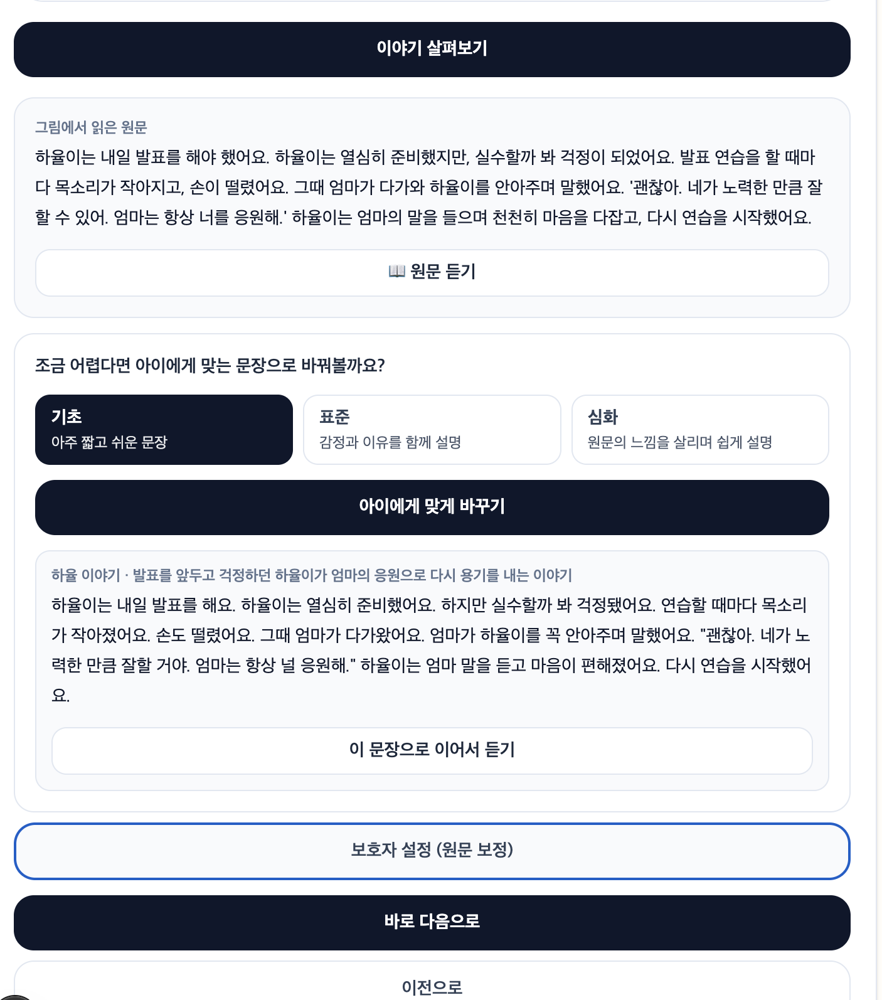
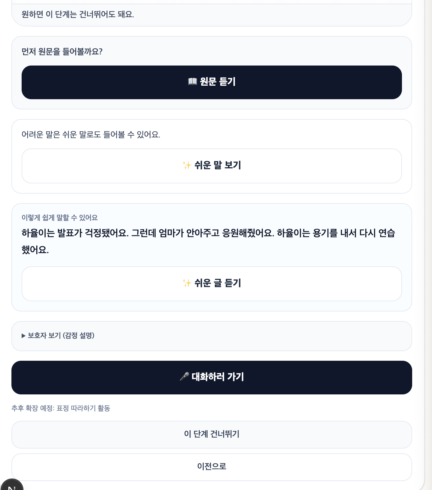
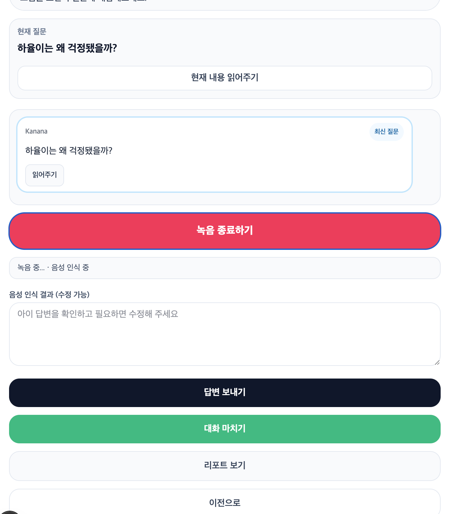
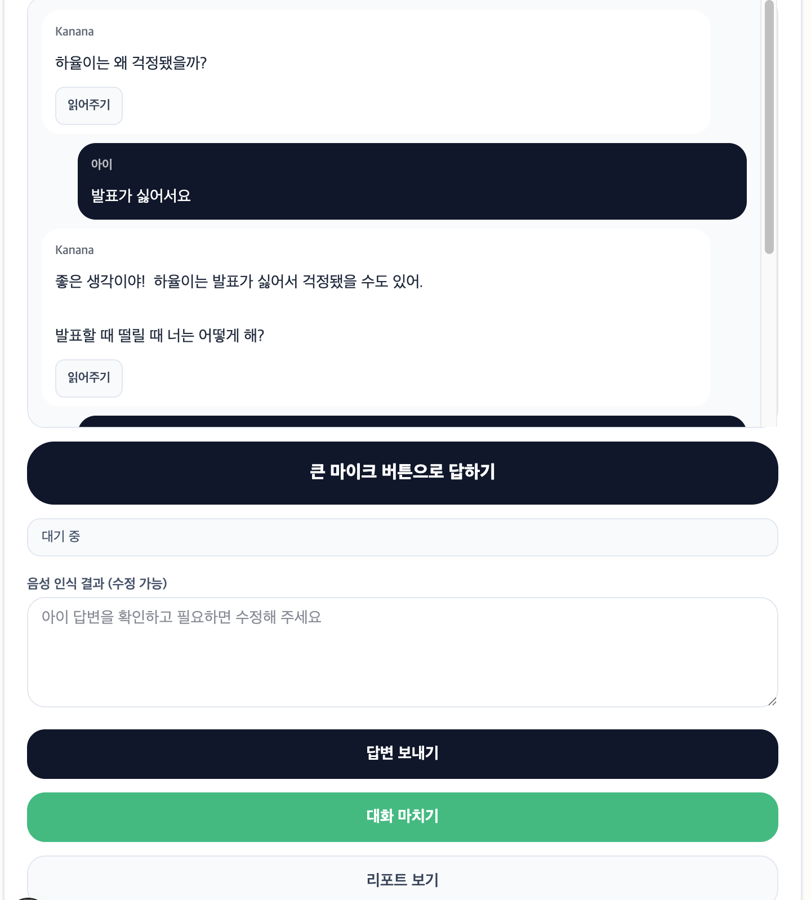
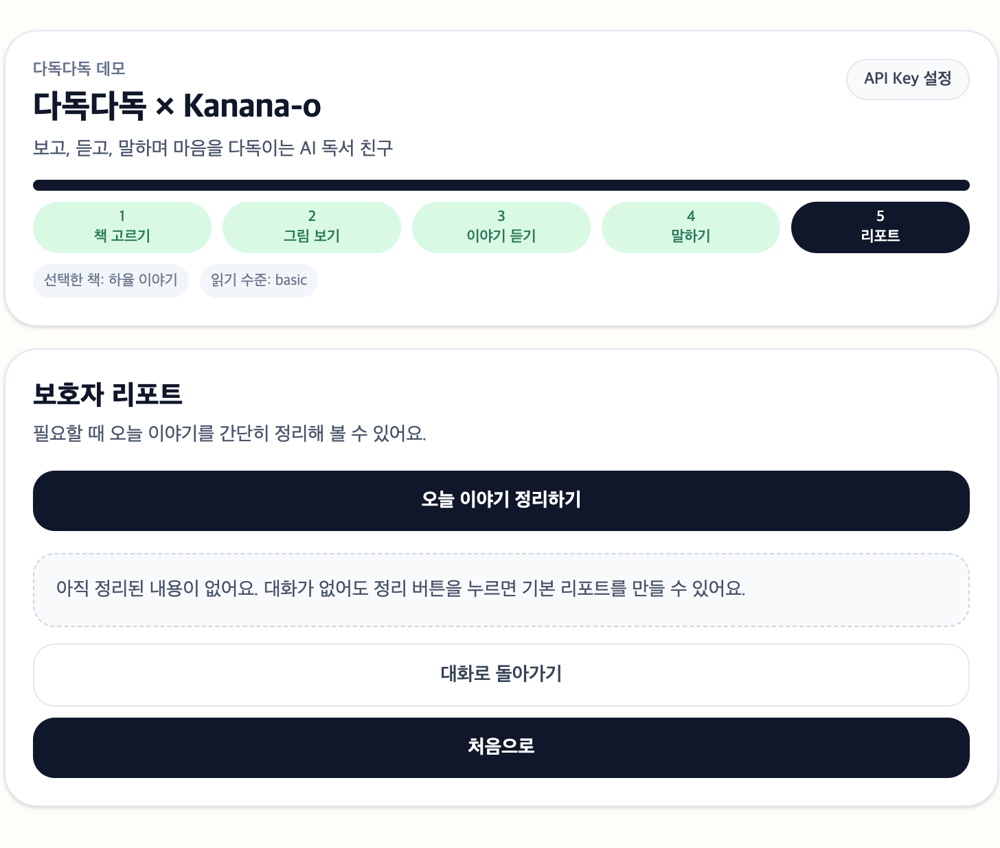
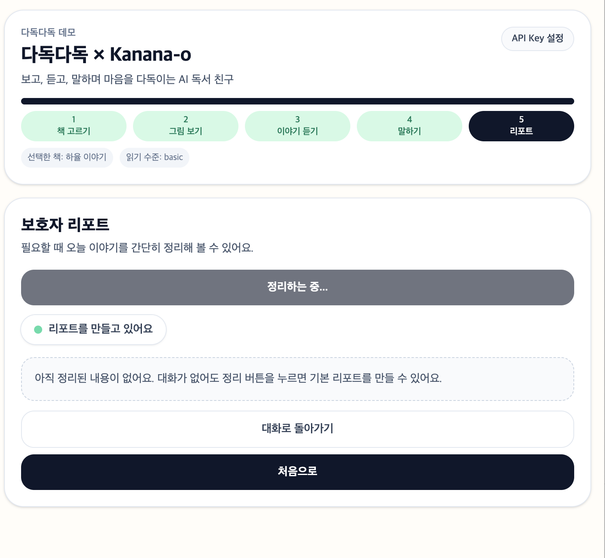

# 다독다독 × Kanana-o

[](https://nextjs.org/)
[](https://www.typescriptlang.org/)
[](https://tailwindcss.com/)
[](./LICENSE)

> 발달장애 아동이 그림책을 보고, 듣고, 말하며 감정을 이해하도록 돕는 AI 독서 친구 데모

## 프로젝트 배경
다독다독은 Kanana-o 옴니모달 API를 **실제 독서 교육 시나리오**에 연결해 검증하기 위한 데모입니다.

- 아이가 글을 직접 읽기 어려워도, 그림을 보며 이야기를 듣고 대화할 수 있도록 설계했습니다.
- 목표는 정답 채점이 아니라 **감정 이해와 표현 연습**을 돕는 것입니다.
- 리포트는 관찰 보조용이며 진단/치료 목적이 아닙니다.

## 데모 영상 / 스크린샷
- 데모 영상: `TODO - 영상 링크 추가`

### Step 1. 책 고르기


### Step 2. 그림 보기



### Step 3. 이야기 듣기



### Step 4. 말하기




### Step 5. 보호자 리포트




## 핵심 사용자 흐름
1. 책 고르기: 토끼/원숭이/하율 이야기 중 선택
2. 그림 보기: 원문과 장면 확인, 필요 시 아이 수준에 맞게 바꾸기
3. 이야기 듣기: 원문/쉬운 글 음성 듣기
4. 말하기: Kanana 질문 → 아이 답변 → 피드백/다음 질문
5. 리포트: 대화 기반 보호자 요약 리포트 생성

## 주요 기능
| 기능 | 설명 | 호출 시점 |
|---|---|---|
| 그림책 분석 | 이미지 OCR + 장면/감정/질문 생성 | `이야기 살펴보기` 클릭 |
| 수준별 문장 변환 | 기초/표준/심화 문장 재구성 | `아이에게 맞게 바꾸기` 클릭 |
| 음성 읽기 | Kanana TTS 우선, 브라우저 음성 fallback | `원문 듣기`/`쉬운 글 듣기` 클릭 |
| 멀티턴 대화 | 음성/텍스트 답변 기반 피드백과 다음 질문 | `답변 보내기` 클릭 |
| 보호자 리포트 | 대화 기록 기반 관찰 요약 | `오늘 이야기 정리하기` 클릭 |

## 기술 스택
- Next.js App Router
- TypeScript
- Tailwind CSS v4
- React state + localStorage
- MediaRecorder / Web Speech API / SpeechSynthesis

## 폴더 구조 (요약)
```text
src/
  app/          # Next.js 페이지와 API 라우트
  components/   # Step UI와 재사용 컴포넌트
  hooks/        # 녹음, 음성 인식, 음성 출력, localStorage 훅
  lib/          # Kanana API, prompt, 타입, 유틸
  data/         # 그림책 샘플 데이터
docs/           # 기술 문서
```

## 실행 방법
```bash
npm install
npm run dev
npm run lint
npm run build
```

## API Key 입력 방식
1. 상단 `API Key 설정` 버튼 클릭
2. 사용자 본인 Kanana API Key 입력
3. 키는 localStorage(`dadokdadok.kanana.apiKey`)에만 저장
4. 서버/DB에 영구 저장하지 않음

## 현재 한계
- Kanana 오디오 응답 포맷의 일부는 문서 불확실성으로 TODO 유지
- 브라우저별 Web Speech API 지원 편차 존재
- 기관용 다중 세션 관리 기능 미구현

## 향후 개선 방향
- 스토리 라이브러리/페이지 확장
- 아동별 세션 히스토리 및 비교 리포트
- STT/TTS 품질 고도화
- 기관용 리포트 분리

## 문서
- [Architecture](./docs/ARCHITECTURE.md)
- [Kanana API Flow](./docs/KANANA_API_FLOW.md)

## 참고 문서
- Kanana API 문서: <https://huggingface.co/kakaocorp/Kanana-1.5-o-9.8B-instruct-2602-API_Doc>

---

주의 문구:  
이 프로젝트의 피드백/리포트는 독서 활동 관찰을 돕기 위한 참고 자료이며, 진단이나 치료 효과를 의미하지 않습니다.
