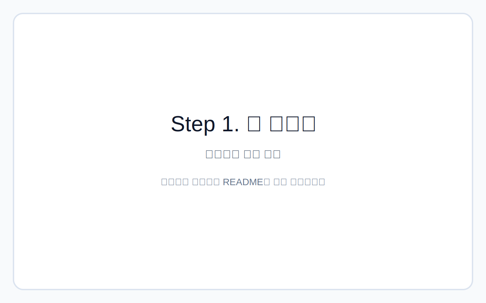
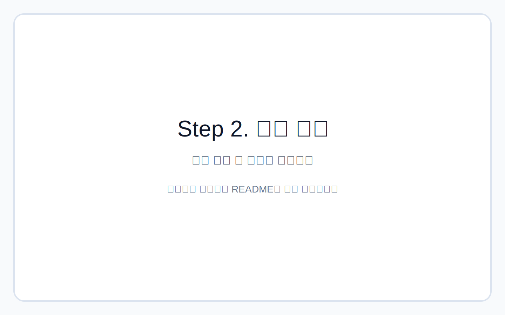
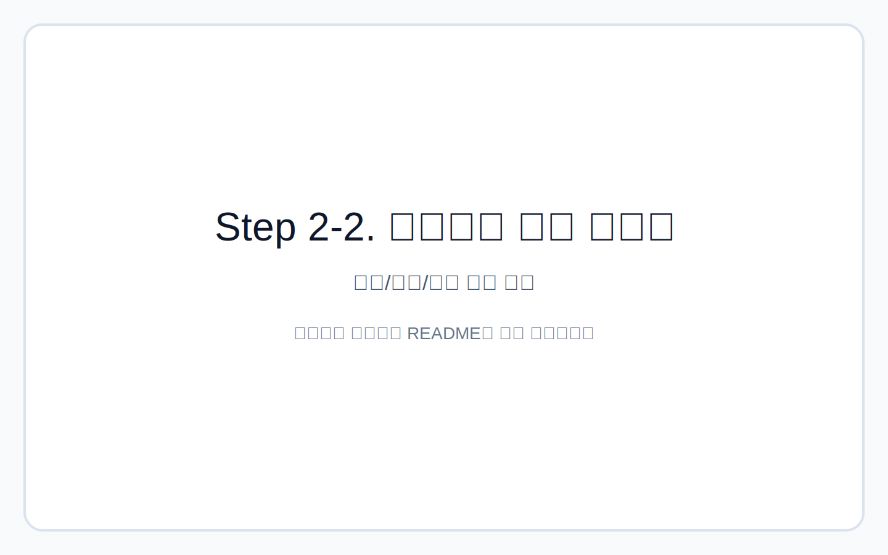
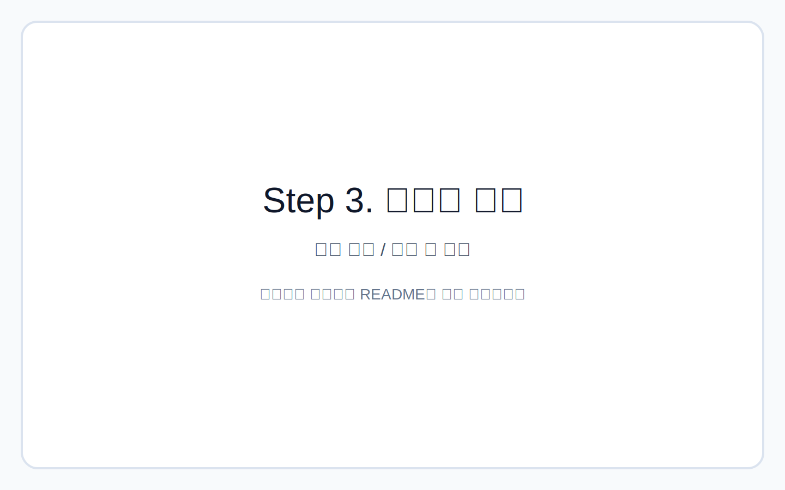
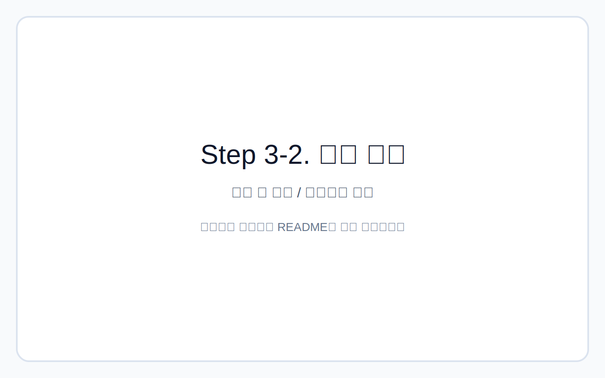
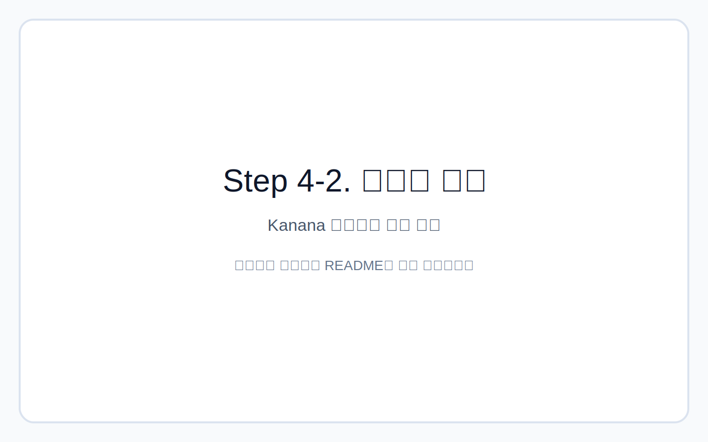
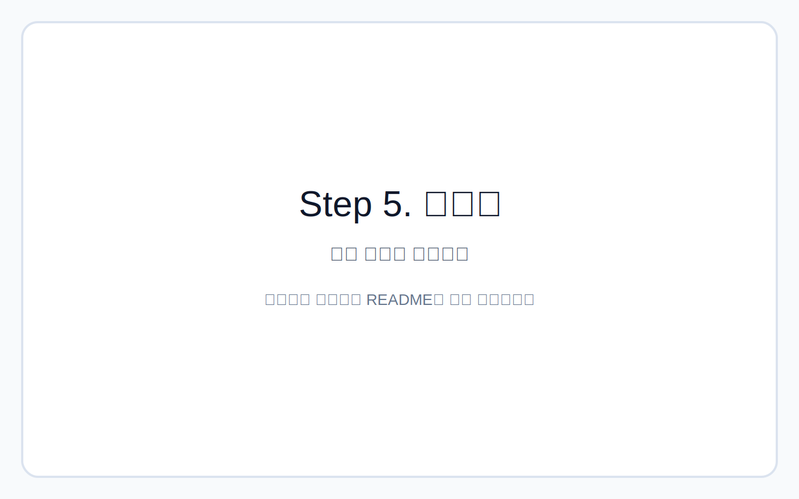
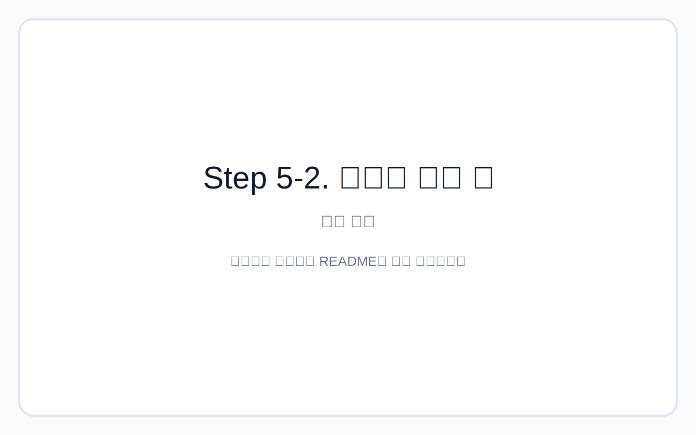
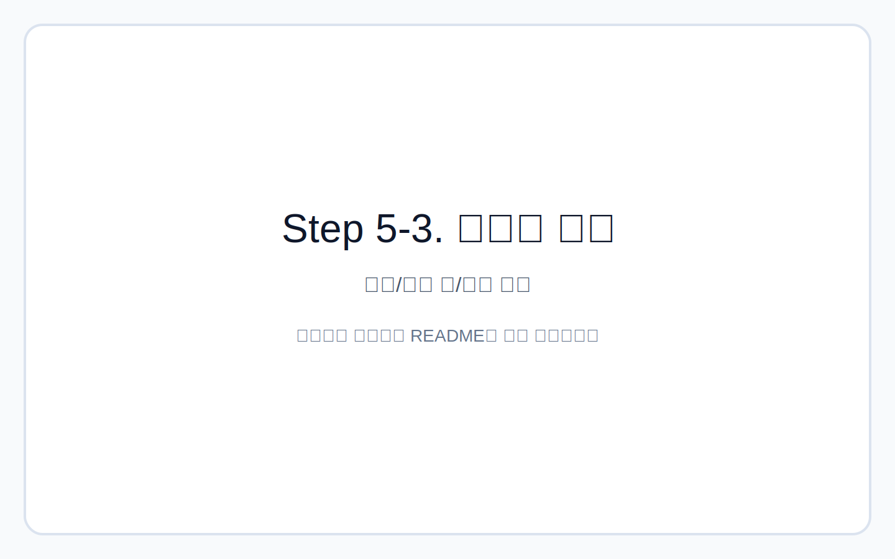

# 다독다독 × Kanana-o

[](https://nextjs.org/)
[](https://www.typescriptlang.org/)
[](https://tailwindcss.com/)
[](#)

> 발달장애 아동이 그림책을 보고, 듣고, 말하며 감정을 이해하도록 돕는 AI 독서 친구 데모

## 프로젝트 소개
다독다독은 Kanana-o 옴니모달 API를 실제 교육 시나리오에 연결해 검증하기 위한 데모입니다.

- `다독다독`은 **책을 많이 읽는 경험**과 **아이 마음을 다독여 주는 경험**을 함께 담은 이름입니다.
- 목표는 정답 채점이 아니라, **짧고 따뜻한 멀티턴 대화**로 감정 이해와 표현 연습을 돕는 것입니다.
- 이 프로젝트는 의료/치료 목적이 아닌 **독서 활동 관찰 지원 도구**입니다.

## 데모 영상 / 스크린샷
- 데모 영상: `TODO - 영상 링크 추가`

### Step 1. 책 고르기
아이와 보호자가 오늘 읽을 그림책을 선택하는 시작 화면입니다.



### Step 2. 그림 보기
선택한 그림책의 원문과 장면을 먼저 확인하는 단계입니다.



### Step 2-2. 아이에게 맞게 바꾸기
원문이 어렵다면 기초/표준/심화 수준으로 문장을 바꾸는 흐름입니다.



### Step 3. 이야기 듣기
아이가 글을 직접 읽지 않아도 원문/쉬운 글을 음성으로 들을 수 있습니다.




### Step 4. 말하기 (멀티턴 대화)
Kanana 질문을 듣고 음성으로 답한 뒤, 피드백과 다음 질문으로 이어지는 단계입니다.




### Step 5. 보호자 리포트
대화 내용을 바탕으로 오늘 독서 활동을 간단히 정리해 보는 단계입니다.





> 현재는 Step별 placeholder 이미지를 연결해두었습니다.  
> 같은 파일명으로 실제 스크린샷을 교체하면 README에 자동 반영됩니다.

## 핵심 사용자 흐름
1. **책 고르기**: 토끼 이야기 / 원숭이 이야기 / 하율 이야기 중 선택
2. **그림 보기**: 원문(OCR) 확인 + 필요 시 아이 수준(기초/표준/심화)으로 문장 변환
3. **이야기 듣기**: 원문/쉬운 글을 음성으로 듣기
4. **말하기**: Kanana 질문 → 아이 답변(녹음/텍스트) → Kanana 피드백/다음 질문
5. **리포트**: 대화 기반 보호자 관찰 리포트 생성

## 주요 기능
| 기능 | 설명 | API 호출 시점 |
|---|---|---|
| 그림책 라이브러리 | 3권 스토리 선택(감정 테마별) | 없음 |
| 이미지 분석 | OCR + 장면 + 쉬운 글 + 감정 + 질문 생성 | `이야기 살펴보기` 클릭 시 |
| 수준별 문장 변환 | 기초/표준/심화 재구성 | `이 수준으로 바꾸기` 클릭 시 |
| 이야기 읽어주기 | 원문/쉬운 글 읽기 (Kanana TTS 우선, 브라우저 fallback) | `듣기` 버튼 클릭 시 |
| 멀티턴 대화 | 피드백 + 다음 질문 + 대화 기록 누적 | `답변 보내기` 클릭 시 |
| 보호자 리포트 | 오늘 장면/강점/다음 질문 가이드 | `오늘 이야기 정리하기` 클릭 시 |

## Kanana-o API 활용 방식
### 1) 그림책 분석 (`analyze_story`)
- 입력: 이미지(base64), 아동 수준, 보정 텍스트(선택)
- 출력: `extractedText`, `sceneDescription`, `easyText`, `emotion`, `childQuestion` 등

### 2) 수준별 변환 (`adapt_level_text`)
- 입력: 원문, 책 메타데이터, 목표 수준(`basic | standard | advanced`)
- 출력: `adaptedText` (해당 수준의 문장)

### 3) 멀티턴 대화 (`conversation_turn`)
- 입력: 현재 질문, 대화 이력, 아이 답변 텍스트/음성
- 출력: `feedbackForChild`, `nextQuestion`, `shouldContinue`, `parentObservation`

### 4) 리포트 (`parent_report`)
- 입력: 분석 결과, 대화 이력, 읽기 수준
- 출력: 장면 요약, 아이 강점, 어려웠던 점, 다음 질문

### 5) 음성 출력 (`tts`)
- 우선 Kanana TTS 시도
- 실패 시 `SpeechSynthesis` fallback

## 기술 스택
- **Framework**: Next.js App Router
- **Language**: TypeScript
- **Styling**: Tailwind CSS v4
- **State**: React state + localStorage
- **Audio**: MediaRecorder, Web Speech API, SpeechSynthesis

## 폴더 구조
```text
src/
  app/
    api/kanana/route.ts      # Kanana API 프록시/파싱/액션 분기
    layout.tsx               # 메타데이터, 공통 레이아웃
    page.tsx                 # 상태 오케스트레이션, step 연결
    globals.css              # 전역 스타일
  components/
    StepNavigation.tsx       # 상단 step 네비게이션
    ApiKeyInput.tsx          # API Key 입력 모달
    StoryCard.tsx            # 책 카드
    MessageBubble.tsx        # 대화 말풍선
    steps/
      StorySelectStep.tsx    # Step 1
      StoryViewStep.tsx      # Step 2
      StoryListenStep.tsx    # Step 3
      ConversationStep.tsx   # Step 4
      ParentReportStep.tsx   # Step 5
  data/
    sampleStory.ts           # 3권 라이브러리 + fallback 데이터
  hooks/
    useRecorder.ts           # 음성 녹음
    useSpeechRecognition.ts  # 음성 인식 fallback
    useSpeechSynthesis.ts    # 음성 읽기 fallback
    useLocalStorage.ts       # 로컬 저장소 상태
  lib/
    kanana.ts                # API 호출 래퍼
    prompt.ts                # 프롬프트 템플릿
    types.ts                 # 공용 타입
    json.ts                  # 안전 JSON 파싱
    audio.ts                 # 오디오 유틸
    storage.ts               # localStorage key 상수
```

## 실행 방법
```bash
npm install
npm run dev
npm run lint
npm run build
```

- 개발 서버: `http://localhost:3000`

## API Key 입력 방식
1. 상단 `API Key 설정` 버튼 클릭
2. 사용자 본인의 Kanana API Key 입력
3. 키는 브라우저 localStorage(`dadokdadok.kanana.apiKey`)에만 저장
4. 서버 DB에 영구 저장하지 않음

## 주요 구현 포인트
- **선택 진행형 UX**: 일부 기능을 건너뛰어도 데모 진행 가능
- **fallback 우선 설계**: API 오류 시에도 흐름이 끊기지 않도록 기본 데이터 사용
- **아동 안전 표현**: 진단/치료/평가/점수화 표현 금지
- **멀티턴 대화 최적화**: 짧은 피드백 + 한 번에 한 질문 유지
- **오디오 하이브리드**: Kanana + 브라우저 API fallback

## 현재 한계
- Kanana 오디오 응답 포맷 일부는 문서 불확실성으로 TODO 유지
- Web Speech API는 브라우저별 지원 편차 존재
- 기관용 계정/다중 아동 세션 관리는 미구현

## 향후 개선 방향
- 스토리 라이브러리 확대(다중 페이지/책장 UI)
- 아동별 세션 저장 및 비교 리포트
- Kanana STT/TTS 품질 고도화
- 보호자 리포트 템플릿 고도화 및 기관용 리포트 분리

## 보안 체크리스트
- [x] API Key 하드코딩 없음
- [x] `.env*`, `.next`, `node_modules` gitignore 포함
- [x] 민감 데이터(개인정보/비밀키) 미포함
- [x] API Key 저장 위치(localStorage) 문서화

## 참고 문서
- Kanana API 문서: <https://huggingface.co/kakaocorp/Kanana-1.5-o-9.8B-instruct-2602-API_Doc>

---

주의 문구:  
이 프로젝트의 피드백/리포트는 독서 활동 관찰을 돕기 위한 참고 자료이며, 진단이나 치료 효과를 의미하지 않습니다.
