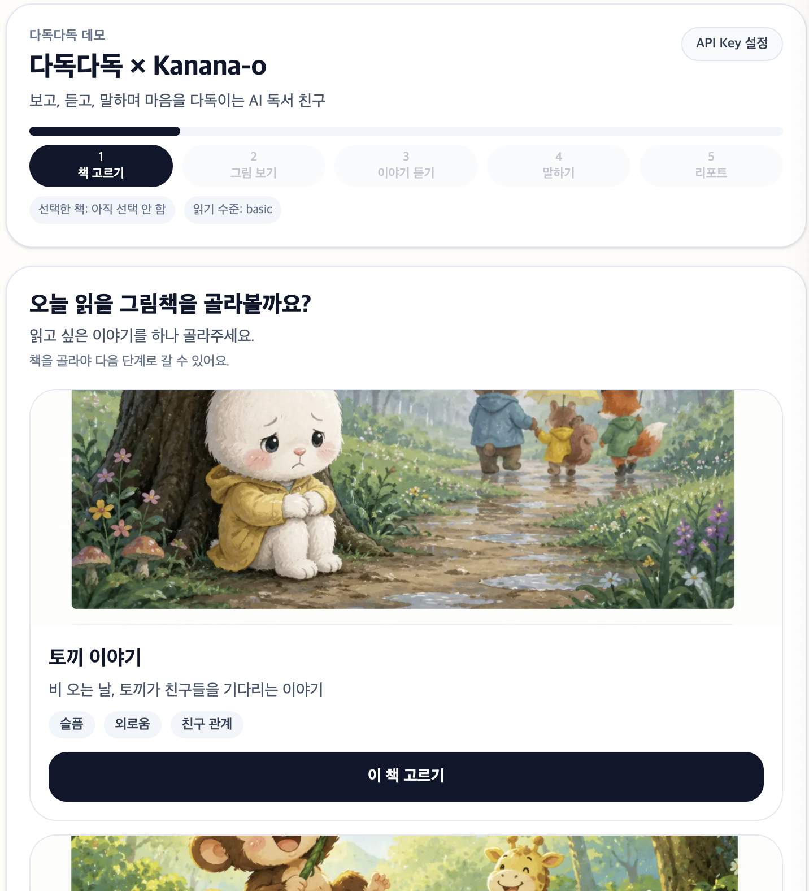
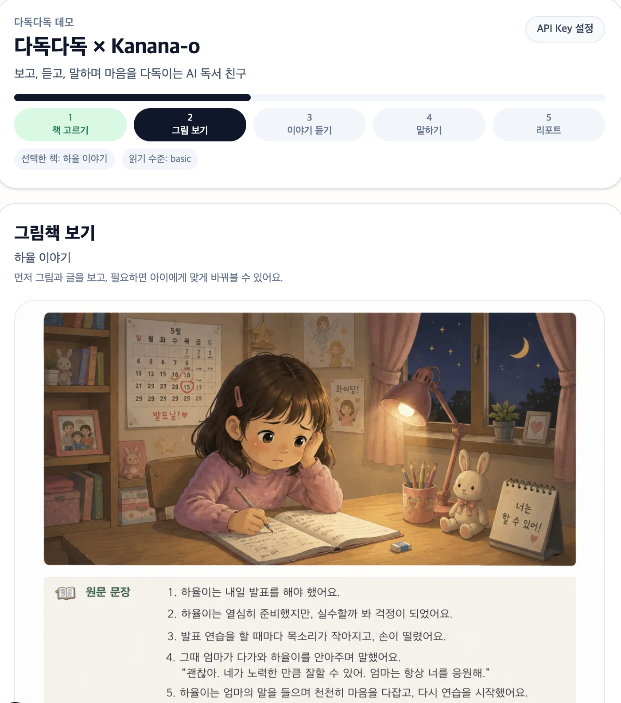
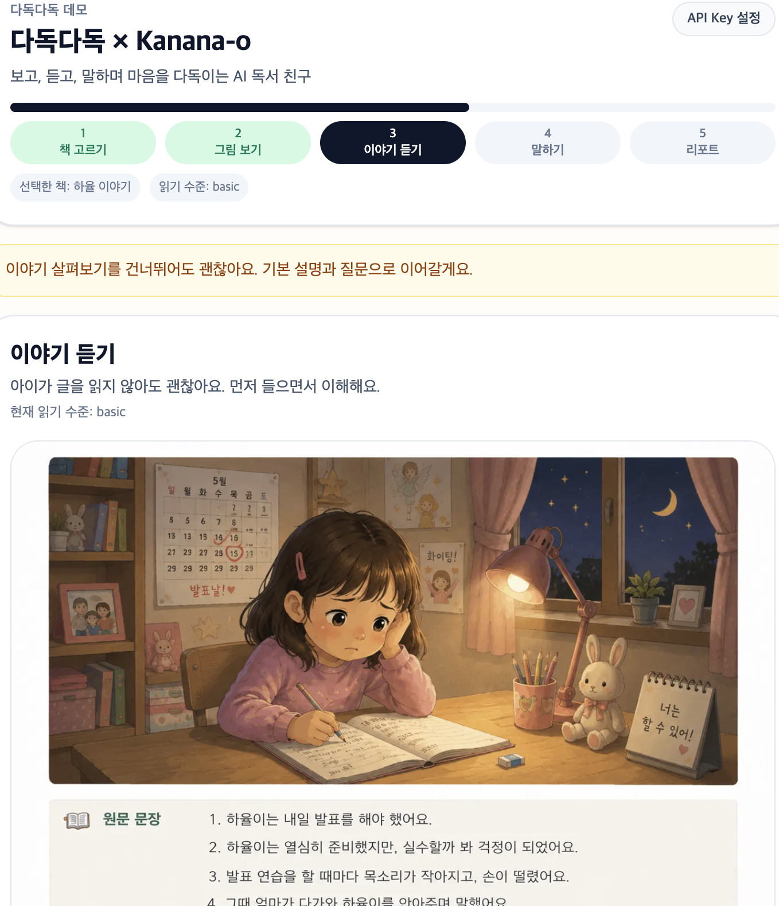
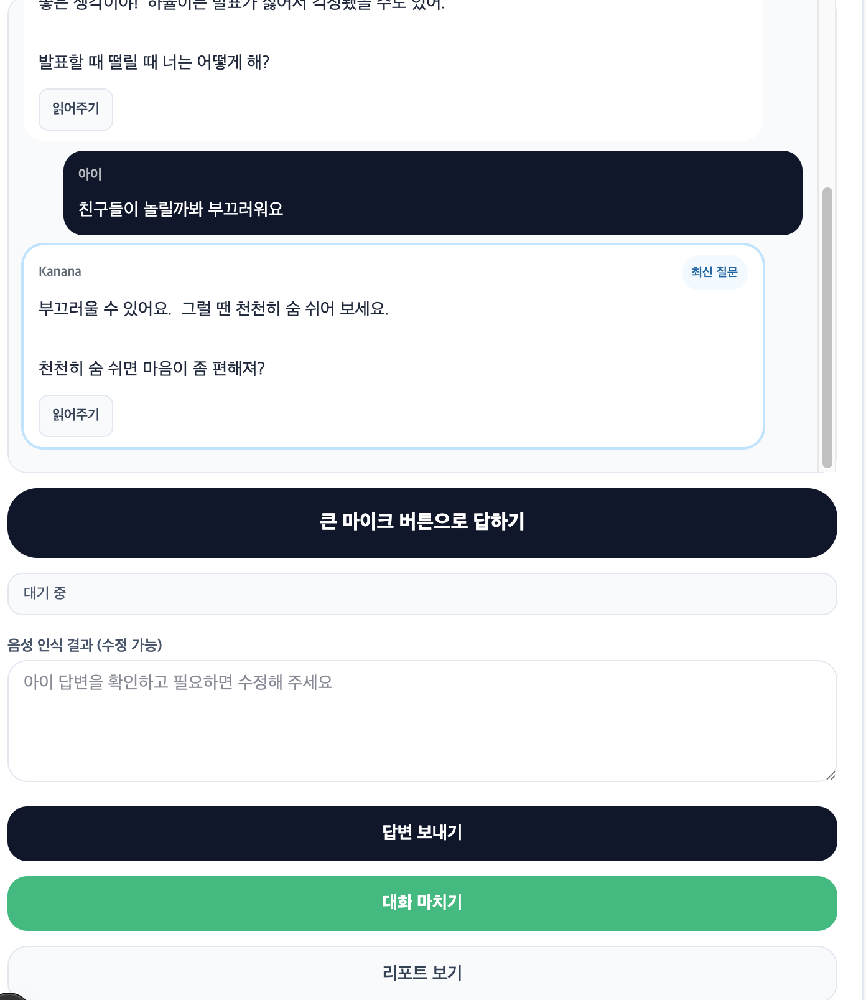
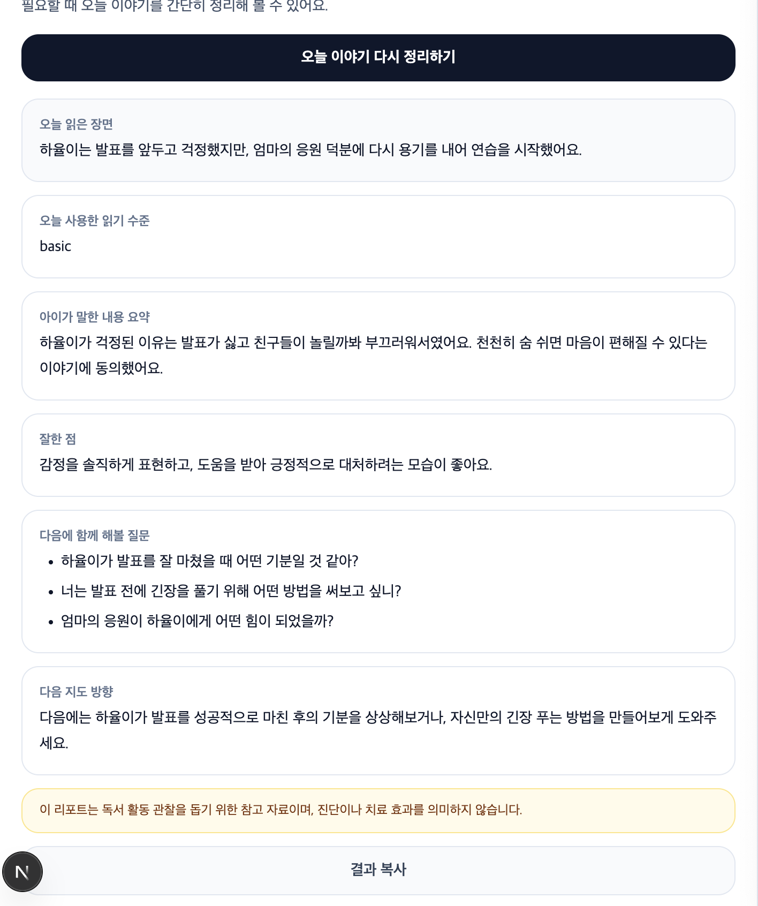

# 다독다독 × Kanana-o

[](https://dadokdadok-kanana.vercel.app)
[](https://nextjs.org/)
[](https://www.typescriptlang.org/)
[](https://tailwindcss.com/)
[](./LICENSE)

> 다독다독은 발달장애 아동이 그림책을 보고, 듣고, 말하며 감정을 이해할 수 있도록 돕는 AI 독서 친구입니다.

## Demo
- Live Service: [https://dadokdadok-kanana.vercel.app](https://dadokdadok-kanana.vercel.app)
- 사용자는 자신의 Kanana API Key를 직접 입력해 데모를 체험할 수 있습니다.

## 프로젝트 소개
다독다독은 Kanana-o를 활용해 그림책 독서 과정을 대화형 경험으로 확장한 MVP 서비스입니다.  
아이가 읽기 어려운 문장도 원문/쉬운 문장으로 듣고, Kanana와 멀티턴 대화를 이어가며 감정을 표현할 수 있도록 설계했습니다.

## 핵심 화면


## Step Flow
1. 책 고르기


2. 그림 보기


3. 이야기 듣기


4. 말하기 (멀티턴 대화)


5. 보호자 리포트


추가 스크린샷은 [`./docs/screenshots`](./docs/screenshots)에서 확인할 수 있습니다.

## 주요 기능
| 기능 | 설명 | 호출 시점 |
|---|---|---|
| 그림책 분석 | 이미지 OCR + 장면/감정/질문 생성 | `이야기 살펴보기` 클릭 |
| 수준별 문장 변환 | 기초/표준/심화 문장 재구성 | `아이에게 맞게 바꾸기` 클릭 |
| 음성 읽기 | Kanana TTS 우선, 브라우저 음성 fallback | `원문 듣기`/`쉬운 글 듣기` 클릭 |
| 멀티턴 대화 | 음성/텍스트 답변 기반 피드백과 다음 질문 | `답변 보내기` 클릭 |
| 보호자 리포트 | 대화 기록 기반 관찰 요약 | `오늘 이야기 정리하기` 클릭 |

## 기술 스택
- Next.js App Router
- TypeScript
- Tailwind CSS v4
- MediaRecorder / Web Speech API / SpeechSynthesis
- Kanana-o API

## 배포 상태
- 현재 Vercel을 통해 실제 배포 완료: [dadokdadok-kanana.vercel.app](https://dadokdadok-kanana.vercel.app)
- 모바일/데스크톱 환경에서 사용 가능
- 사용자가 직접 API Key를 입력해 즉시 테스트 가능

## Repository / Demo / Tech Stack
- Repository: [https://github.com/mk-isos/dadokdadok-kanana](https://github.com/mk-isos/dadokdadok-kanana)
- Demo: [https://dadokdadok-kanana.vercel.app](https://dadokdadok-kanana.vercel.app)
- Tech Stack: Next.js / TypeScript / Tailwind / Kanana-o API

## 폴더 구조 (요약)
```text
src/
  app/          # Next.js 페이지와 API 라우트
  components/   # Step UI와 재사용 컴포넌트
  hooks/        # 녹음, 음성 인식, 음성 출력, localStorage 훅
  lib/          # Kanana API, prompt, 타입, 유틸
  data/         # 그림책 샘플 데이터
docs/           # 기술 문서
```

## 실행 방법
```bash
npm install
npm run dev
npm run lint
npm run build
```

## API Key 입력 방식
1. 상단 `API Key 설정` 버튼 클릭
2. 사용자 본인 Kanana API Key 입력
3. 키는 localStorage(`dadokdadok.kanana.apiKey`)에만 저장
4. 서버/DB에 영구 저장하지 않음

## 현재 한계
- Kanana API 응답 속도에 따라 음성 UX 체감이 달라질 수 있습니다.
- Web Speech API는 브라우저별 지원 차이가 있습니다.
- 현재는 단일 페이지 기반 그림책 데모 흐름 중심입니다.
- 실제 기관용 계정/관리 기능은 포함되지 않습니다.

## 향후 개선 방향
- 다중 페이지 그림책 읽기 흐름 지원
- 사용자(아동) 세션 저장 및 이력 비교
- 보호자 계정 기능 및 리포트 히스토리
- 기관용 리포트/관리자 기능
- Kanana 기반 감정형 음성 피드백 강화
- 그림책 라이브러리 확대

## Documents
- [Architecture](./docs/ARCHITECTURE.md)
- [Kanana API Flow](./docs/KANANA_API_FLOW.md)

## 참고 문서
- Kanana API 문서: <https://huggingface.co/kakaocorp/Kanana-1.5-o-9.8B-instruct-2602-API_Doc>

---

주의 문구:  
이 프로젝트의 피드백/리포트는 독서 활동 관찰을 돕기 위한 참고 자료이며, 진단이나 치료 효과를 의미하지 않습니다.
